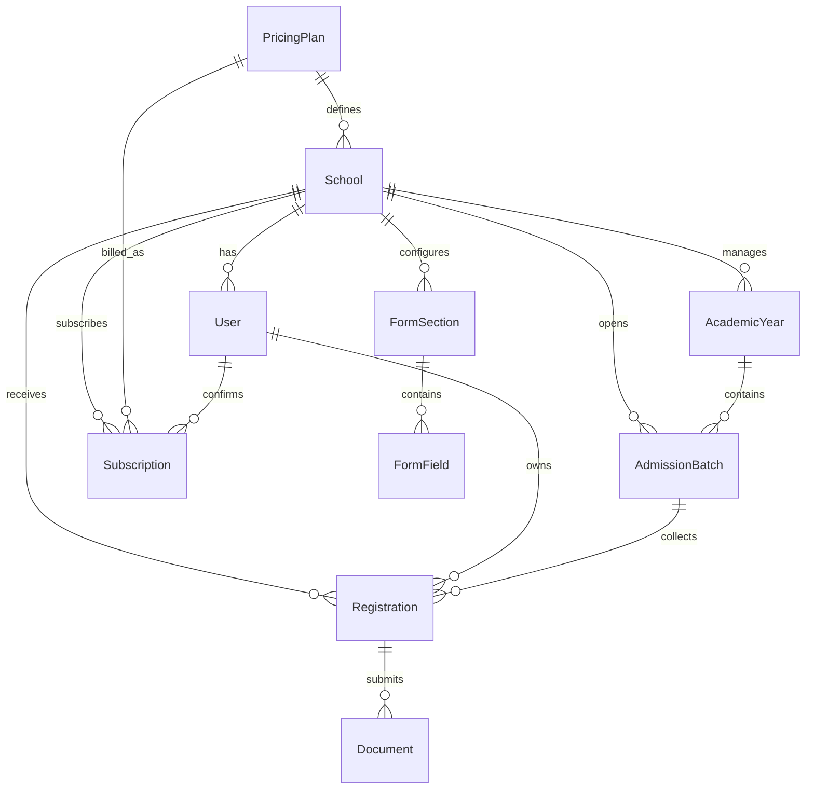

# PPDB Pro - SaaS Penerimaan Peserta Didik Baru Online

[](https://laravel.com)
[](LICENSE)
[](https://ozanproject.site)

**PPDB Pro** adalah platform *Software as a Service* (SaaS) mutakhir yang dirancang untuk mendigitalisasi proses penerimaan siswa baru secara masif dan terintegrasi. Platform ini memungkinkan setiap instansi sekolah untuk memiliki portal pendaftaran mandiri dengan fitur kustomisasi formulir pendaftaran, manajemen zona waktu, dan sistem langganan paket harga yang dikelola secara terpusat oleh Super Admin.

🔗 **Demo Live:** [ozanproject.site](https://ozanproject.site)
🔗 **Repository:** [github.com/OzanProject/smartppdb](https://github.com/OzanProject/smartppdb.git)

---

## 🚀 Fitur Unggulan

### 1. Multi-Tenancy Architecture
Satu instalasi aplikasi dapat melayani ribuan sekolah dengan isolasi data yang aman. Setiap sekolah memiliki subdomain/slug unik dan database operasional yang terpisah secara logika.

### 2. Dynamic Form Builder
Admin Sekolah dapat membangun formulir pendaftaran mereka sendiri (Drag & Drop Logic) tanpa bantuan developer. Mendukung berbagai tipe input seperti teks, pilihan ganda, hingga unggah dokumen.

### 3. Subscription & Monetization System
Super Admin dapat mengelola paket harga (Pricing Plans) dengan kontrol penuh terhadap:
*   **Hak Akses Modul:** Mengaktifkan/menonaktifkan fitur tertentu per paket.
*   **Kuota Pendaftar:** Batasan jumlah siswa yang boleh mendaftar per sekolah.
*   **Billing Cycle:** Dukungan pembayaran Bulanan, Tahunan, atau Sekali Bayar.

### 4. Multi-Timezone Management
Sistem mendukung perbedaan waktu Indonesia (WIB, WITA, WIT) yang dapat diatur secara spesifik per sekolah agar stempel waktu pendaftaran dan log aktivitas tetap akurat sesuai lokasi sekolah.

---

## 🖼️ Tampilan Antarmuka (Previews)

### Dashboard Super Admin
*Pusat kendali seluruh sekolah, manajemen paket harga, dan statistik pendapatan platform.*


### Dashboard Admin Sekolah
*Ruang kerja untuk sekolah mengelola calon siswa, konfigurasi gelombang, dan pengaturan formulir.*


### Dashboard Pendaftar (Siswa)
*Portal bagi calon siswa untuk melengkapi berkas, melihat status pengumuman, dan mencetak bukti daftar.*


---

## 🛠️ Teknologi yang Digunakan

*   **Core:** [Laravel 11](https://laravel.com)
*   **Frontend:** HTML5, CSS3, Vanilla JavaScript (Modern UI Architecture)
*   **Database:** MySQL
*   **Styling:** AdminLTE 3 & Custom Premium CSS Components
*   **Alerts:** SweetAlert2
*   **Icons:** FontAwesome 6

---

## 📊 Dokumentasi Teknis

### Entity Relationship Diagram (ERD)



### Logical Schema (LS) Utama
1.  **pricing_plans**: `id, name, price, billing_cycle, allowed_modules (JSON), max_quota, trial_days`
2.  **schools**: `id, name, slug, npsn, pricing_plan_id (FK), timezone, is_active, trial_ends_at`
3.  **users**: `id, name, email, password, role (superadmin, admin_school, staff, applicant), school_id (FK)`
4.  **registrations**: `id, registration_number, user_id (FK), school_id (FK), personal_data (JSON), status`
5.  **form_fields**: `id, form_section_id (FK), label, type, name, options (JSON), is_required`

---

## ⚙️ Panduan Instalasi Lokal

1.  **Clone Repository:**
    ```bash
    git clone https://github.com/OzanProject/smartppdb.git
    cd smartppdb
    ```

2.  **Instalasi Dependensi:**
    ```bash
    composer install
    npm install && npm run dev
    ```

3.  **Konfigurasi Lingkungan:**
    ```bash
    cp .env.example .env
    php artisan key:generate
    ```

4.  **Migrasi & Database Seeding:**
    ```bash
    php artisan migrate --seed
    ```

5.  **Jalankan Aplikasi:**
    ```bash
    php artisan serve
    ```

---

## 📧 Kontak & Kontribusi

Jika Anda menemukan bug atau ingin berkontribusi dalam pengembangan, silakan hubungi pengembang utama:

*   **Ozan Project**
*   **Website:** [ozanproject.site](https://ozanproject.site)
*   **GitHub:** [@OzanProject](https://github.com/OzanProject)

---
*© 2024 PPDB Pro - Solusi Digital untuk Pendidikan Indonesia.*
