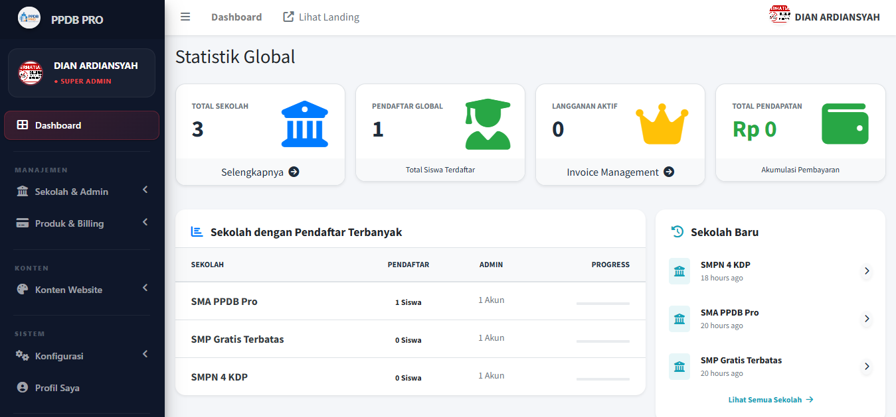
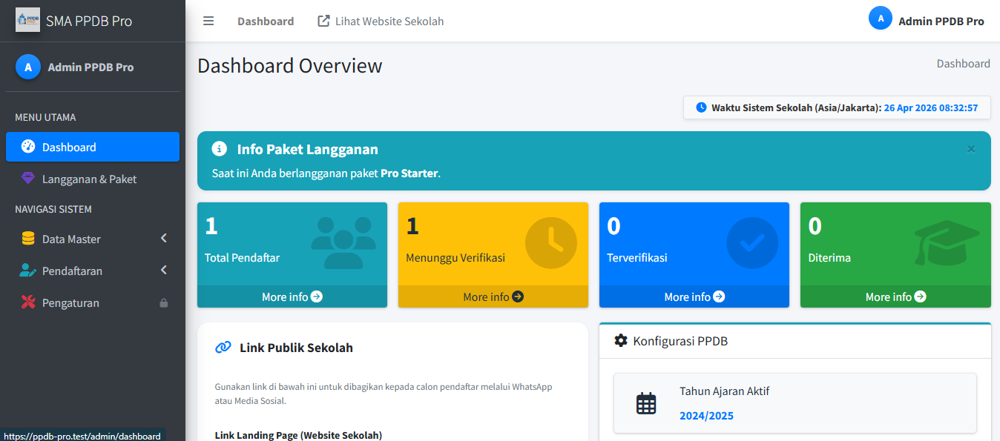
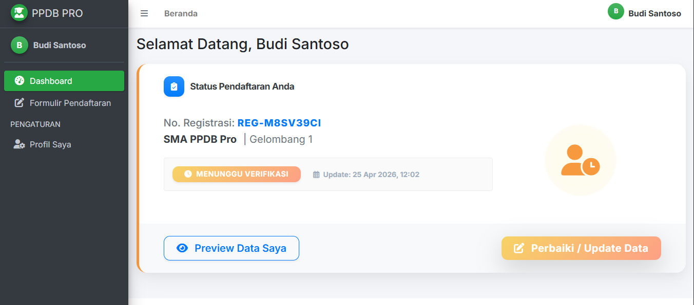
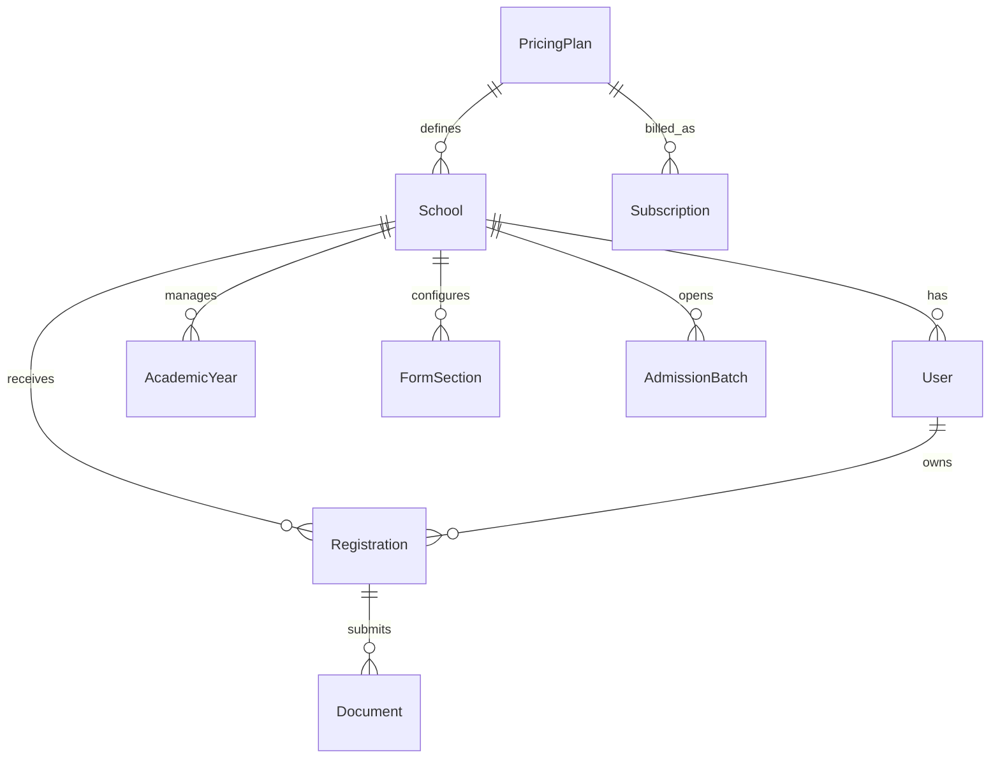

# PPDB Pro: Next-Gen SaaS Admission System

<p align="center">
  <b>Solusi Manajemen Penerimaan Siswa Baru Berbasis SaaS untuk Skala Nasional</b>
  <br>
  <a href="https://ozanproject.site"><strong>Explore the Demo »</strong></a>
  <br>
  <br>
  
  
  
  
</p>

---

## 📖 Tentang Proyek

**PPDB Pro** adalah platform *multi-tenant* yang memungkinkan ribuan sekolah mengelola proses pendaftaran siswa baru secara mandiri dalam satu infrastruktur cloud. Dibangun dengan fokus pada efisiensi, skalabilitas, dan kemudahan penggunaan bagi admin sekolah maupun orang tua siswa.

### 🌟 Fitur Utama (Core Value)

*   **⚡ Dashboard Real-Time**: Pantau statistik pendaftaran, kuota, dan pendapatan secara instan.
*   **🛠️ Dynamic Form Engine**: Sesuaikan formulir pendaftaran per sekolah tanpa kode.
*   **🌍 Multi-Timezone Adaptive**: Sinkronisasi otomatis waktu WIB/WITA/WIT berdasarkan lokasi sekolah.
*   **💰 SaaS Billing System**: Manajemen paket harga otomatis dengan sistem *trial* dan aktivasi lisensi.
*   **🔒 Data Isolation**: Keamanan data antar tenant (sekolah) terjamin dengan proteksi tingkat basis data.

---

## 📸 Tampilan Dashboard

<details>
<summary><b>Klik untuk melihat Screenshot Dashboard</b></summary>
<br>

### 1. Central Control (Super Admin)
*Pusat pengelolaan sekolah, paket harga, dan monitoring infrastruktur.*


### 2. School Management (Admin Sekolah)
*Ruang kerja sekolah untuk mengelola gelombang, seleksi siswa, dan landing page.*


### 3. Applicant Portal (Pendaftar)
*Interface modern dan intuitif untuk calon siswa melengkapi pendaftaran.*


</details>

---

## 🔄 Alur Kerja Sistem (Workflow)

1.  **Pendaftaran SaaS**: Sekolah mendaftar dan memilih paket (atau memulai *free trial*).
2.  **Konfigurasi**: Admin Sekolah mengatur tahun ajaran, gelombang pendaftaran, dan kustomisasi formulir.
3.  **Publikasi**: Landing page sekolah otomatis aktif di subdomain/slug yang dipilih.
4.  **Pendaftaran Siswa**: Calon siswa mendaftar, mengunggah berkas, dan memantau status secara real-time.
5.  **Verifikasi & Seleksi**: Sekolah memverifikasi berkas dan menentukan status kelulusan siswa.

---

## 📊 Arsitektur Basis Data

### Entity Relationship Diagram (ERD)



---

## 🚀 Instalasi Cepat

```bash
# Clone
git clone https://github.com/OzanProject/smartppdb.git

# Install
composer install
npm install && npm run build

# Setup
cp .env.example .env
php artisan key:generate
php artisan migrate --seed
```

---

## 🤝 Kontribusi & Dukungan

Kontribusi selalu terbuka! Silakan lakukan **Fork**, buat **Branch**, dan ajukan **Pull Request**.

*   **Developer:** Ozan Project
*   **Website:** [ozanproject.site](https://ozanproject.site)
*   **GitHub:** [@OzanProject](https://github.com/OzanProject)

---
<p align="center">
  <i>"PPDB Pro - Menghubungkan Pendidikan dengan Teknologi Masa Depan."</i>
</p>
